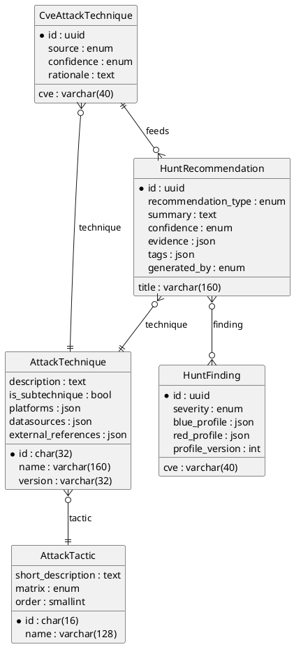

# Modelo de Dados Hunt — Fase 3 (ATT&CK & Recomendações)

## Visão Geral

O diagrama abaixo demonstra as relações principais entre os modelos usados na Fase 3. O `PlantUML` pode ser renderizado executando `plantuml docs/hunt-phase3-modelagem.md` quando a extensão estiver instalada.

## Campos Complementares

- `HuntRecommendation.confidence_note`: anotação curta utilizada para registrar racional detalhado da confiança atribuída pela heurística ou analista. Campo opcional, exposto nas APIs e já coberto por testes (`tests/api/test_hunt_endpoints.py`).
- `HuntRecommendation.playbook_slug`: identificador amigável para vincular recomendações a playbooks reutilizáveis. Mantemos índice parcial (`idx_hunt_rec_playbook`) para acelerar buscas quando o slug estiver preenchido.
- Campos adicionais (como `AttackTechnique.external_references`) continuam livres para expansão, porém sem duplicar conteúdo textual extenso; utilizar referências externas sempre que possível para reduzir custo de manutenção.

## Decisões de Cache e Atualização

- **Busca textual**: permanece em backlog até migração para PostgreSQL. Enquanto estivermos em SQLite, priorizamos índices parciais e filtros combinados (`technique`, `confidence`, `generated_by`) conforme documentado no runbook.
- **Atualização incremental**: `python manage.py import_attack_catalog --pyattck` passa a operar em modo idempotente, reaproveitando `sync_attack_catalog` para comparar `version`/`updated_at` e atualizar apenas registros alterados. O comando é agendado semanalmente via Celery beat (`hunt_sync_attack_catalog`).
- **Delta manual**: quando houver ingestão extraordinária, usar `python manage.py import_attack_catalog --from-file <snapshot.json>` antes de publicar em produção; logs consolidam quantos registros foram inseridos/atualizados (ver `CatalogSyncResult`).
- **Cache local**: manter último snapshot ATT&CK em `tmp/attack_catalog-<data>.json` (diretório já referenciado no runbook) para inspeção rápida durante incidentes.

### Tokens de UI (v1)

Os tokens base do hand-off inicial foram incorporados em `static/css/hunt-detail.css` para garantir consistência entre as abas Blue/Red:

- Azul (accent): `--hunt-blue-050 #e8f1ff`, `--hunt-blue-100 #c9deff`, `--hunt-blue-300 #6aa5ff`, `--hunt-blue-500 #1f5dff`, `--hunt-blue-glass-{100..400}` para estados hover/focus.
- Vermelho (alerta): `--hunt-red-050 #ffecee`, `--hunt-red-100 #ffcfd2`, `--hunt-red-500 #f0444c`, `--hunt-red-glass-{100,200}` para recomendações Red e alertas.
- Neutros: `--hunt-surface`, `--hunt-surface-soft`, `--hunt-surface-soft-border` definem cartões e painéis translúcidos.
- Status auxiliares: `--hunt-amber-glass-100`, `--hunt-amber-text`, `--hunt-indigo-glass-100`, `--hunt-indigo-text` padronizam chips de status.

Qualquer ajuste futuro deve preservar os nomes dos tokens para minimizar refactors nas templates.

## Próximos Passos

1. Registrar backlog de busca textual para futura migração a PostgreSQL (Fase 4+).
2. Considerar campo `confidence_note` em `HuntRecommendation` para registrar ajustes manuais feitos por analistas.
3. Monitorar crescimento do catálogo importado (`AttackTechnique` ~1000 registros) e planejar rotinas de atualização incremental (delta syncs).

## Wireframes preliminares (Blue/Red)

Foram reservados assets (`docs/ui/hunt-blue-red-wireframes.png` e `docs/ui/hunt-dashboard-tabs.sketch`) onde registramos a composição atual. Os tokens descritos na seção anterior já foram aplicados em `static/css/hunt-detail.css`; ajustes futuros ficam restritos a atualizar os valores das variáveis. O protótipo atual no template `templates/hunt/dashboard.html` utiliza componentes `` que facilitam a substituição pelos elementos definitivos assim que os arquivos forem disponibilizados.
